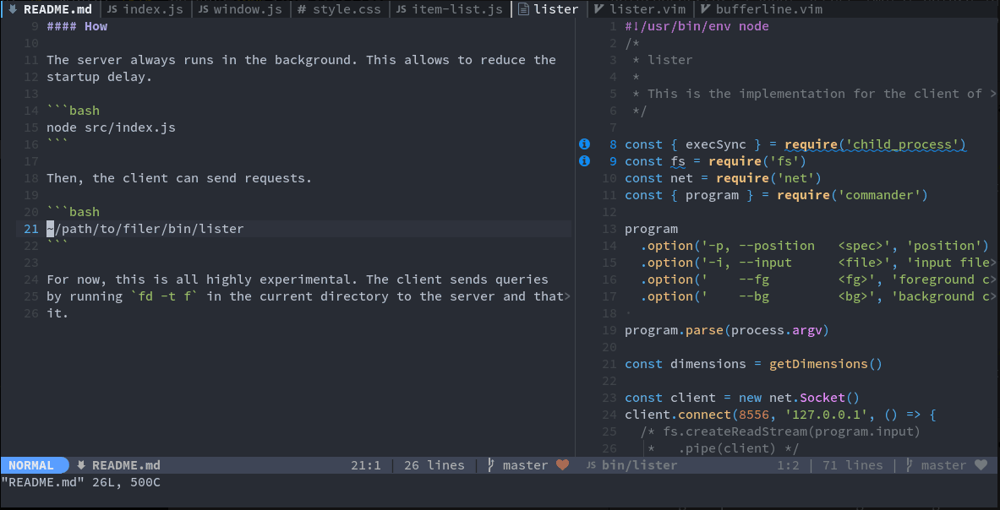

# lister (experimental, not usable yet)



This is a fuzzy picker interface that can be opened from any other 
application.

#### How

The server always runs in the background. This allows to reduce the
startup delay.

```bash
node src/index.js
```

Then, the client can send requests.

```bash
node src/client.js
```

For now, this is all highly experimental. The client sends queries
by running `fd -t f` in the current directory to the server and that's
it.
