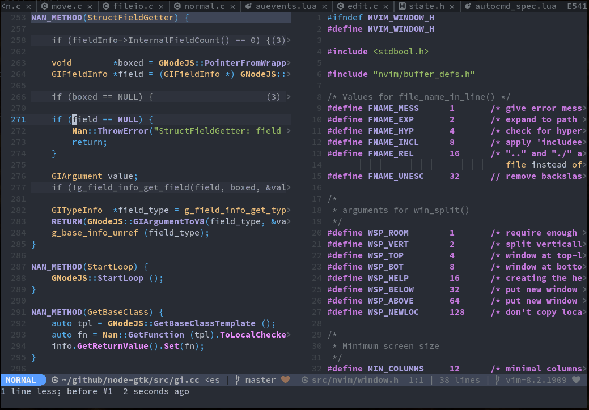

# Lister - Fuzzy finder

This project is in alpha state. If you're interested and want to test it please do so.
Be warned that it requires a particular setup, see requirements below.



This is a fuzzy picker interface that can be opened from any other 
application. It is meant to be used from within neovim.

### Requirements

The current implementation relies on a lot of things. Cross-platformly
opening a window over the active window is not an easy thing to do,
but I will remove dependencies as I find solutions.

 - nodejs
 - Linux
 - ~~X11 && xdotool~~ Gnome (either X11 or Wayland)
 - xwininfo
 - xprop
 - fd
 - C & C++ compiler
 - Gtk+-3.0 library

### Install (for neovim)

```vim
Plug 'romgrk/lister', { 'do': 'npm install' }
```

Then define your mapping for `:Lister`.
The server is started automatically, and you can control it with `:ListerStart` and `:ListerStop`.

### How

The server always runs in the background. This allows to reduce the
startup delay.

```bash
node src/index.js
```

Then, the client can send requests.

```bash
~/path/to/lister/bin/lister
```

For now, this is all highly experimental. The client sends queries
by running `fd -t f` in the current directory to the server and that's
it.
